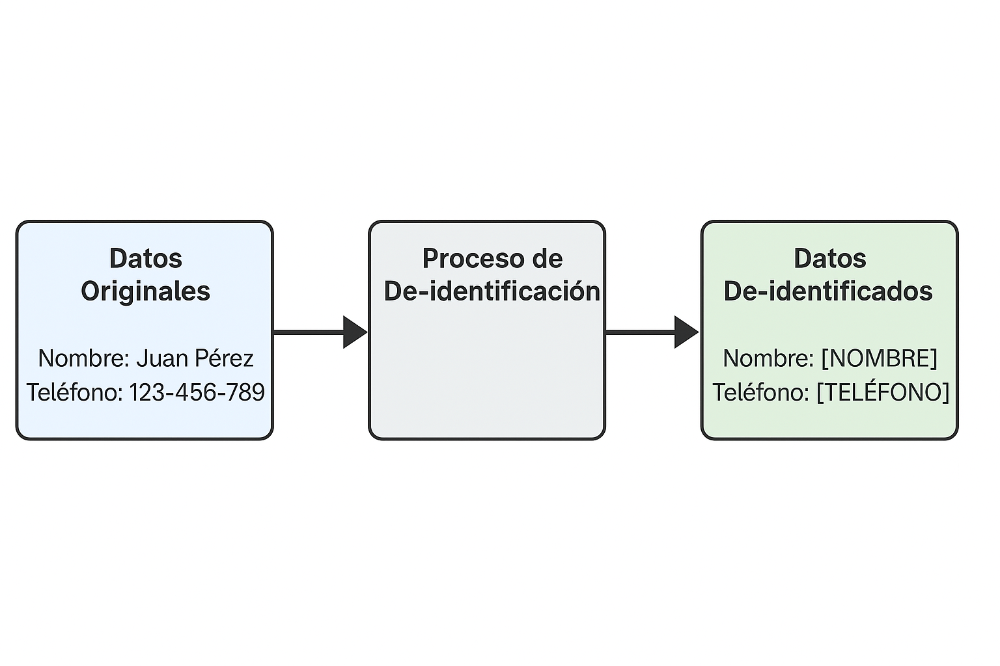

# De-identificación de Datos - Mersad Meyfour Asadi

## Introducción

En el desarrollo de modelos de lenguaje de gran escala (LLMs), garantizar la privacidad de los datos utilizados en el entrenamiento es fundamental. Una de las técnicas más efectivas para lograrlo es la de-identificación de datos, que permite usar información útil sin comprometer la identidad de las personas involucradas.

Existen diversas técnicas de privacidad como los data privacy vaults, datos sintéticos, privacidad diferencial o el uso de LLMs locales. En este documento nos centraremos en la de-identificación por ser una de las más aplicables en escenarios reales.

## ¿Qué es la de-identificación?

La de-identificación es el proceso de eliminar o transformar información personal en un conjunto de datos para evitar que pueda ser vinculada a una persona específica. Es una técnica fundamental para proteger la privacidad cuando se entrena o se usa un modelo de lenguaje (LLM).

### Técnicas comunes

- **Enmascaramiento:** Reemplazo de datos personales por símbolos (ej. `****` o `<NOMBRE>`).
- **Pseudonimización:** Sustitución de nombres reales por identificadores ficticios.
- **Generalización:** Sustitución de detalles específicos por categorías más amplias (ej. “Barcelona” → “España”).
- **Supresión:** Eliminación total del dato sensible.

## ¿Por qué es relevante para los LLMs?

Cuando se usan datos reales para entrenar modelos como GPT, es posible que información privada (como nombres, correos o identificaciones) quede "impresa" en los pesos del modelo, lo que podría generar riesgos si esa información es reproducida en respuestas.

### Ejemplo

Supón que se entrena un LLM con texto como:

```markdown
El número de seguridad social de Ana Pérez es 123-45-6789
```

Si no se de-identifica, el modelo podría "memorizar" este tipo de datos. En cambio, con de-identificación previa, el texto pasaría a:

```markdown
El número de seguridad social de <NOMBRE> es <NUM_SEGURIDAD_SOCIAL>
```

## Herramientas y empresas destacadas

- **Amazon Macie:** Identifica datos sensibles en AWS.
- **Microsoft Presidio:** Proyecto open-source para detectar y anonimizar PII (Personally Identifiable Information).
- **OpenMined:** Comunidad que desarrolla herramientas de privacidad para IA.
- **Google Cloud DLP:** Plataforma de detección y anonimización de datos.

## Casos de uso en empresas

- **Apple** aplica técnicas de privacidad diferencial y de-identificación en su entrenamiento de IA con datos de usuarios.
- **OpenAI** ha sido criticada por no aplicar suficiente de-identificación en datos públicos (como Reddit o StackOverflow).
- **Hugging Face** ha incorporado filtros y anotaciones para preservar la privacidad en datasets.

## Diagrama



> *Imagen generada con IA mediante DALL·E (OpenAI)*

### Descripción del diagrama

1. Datos Originales (Entrada): Muestra un conjunto de datos que contenga información personal identificable (PII), como nombres, direcciones, números de teléfono, etc.
2. Proceso de De-identificación: Representa una caja o proceso intermedio donde se aplican técnicas como enmascaramiento, seudonimización o anonimización para transformar los datos originales. 
3. Datos De-identificados (Salida): Muestra el conjunto de datos resultante, donde la información personal ha sido reemplazada por valores genéricos o seudónimos, preservando la estructura y utilidad de los datos para análisis sin comprometer la privacidad.

### Ejemplo

```markdown
• Entrada: Nombre: Juan Pérez, Teléfono: 123-456-789 
• Proceso de De-identificación: Aplicación de técnicas de enmascaramiento o seudonimización. 
• Salida: Nombre: [NOMBRE], Teléfono: [TELÉFONO]
```

Este diagrama ayudará a visualizar cómo la de-identificación protege la privacidad de los individuos al eliminar o transformar la información personal en los conjuntos de datos utilizados para entrenar modelos de lenguaje.

## Referencias

- [https://github.com/microsoft/presidio](https://github.com/microsoft/presidio)
- [https://cloud.google.com/dlp](https://cloud.google.com/dlp)
- "Privacy-Preserving Machine Learning" - Cynthia Dwork et al.

## Conclusión

La de-identificación es una herramienta poderosa que permite usar datos personales en el entrenamiento de modelos sin comprometer la privacidad. Aplicada correctamente, mejora la confianza de los usuarios y reduce riesgos legales, siendo una práctica esencial en el desarrollo de soluciones basadas en LLMs.

## Créditos

Este contenido ha sido elaborado por Mersad Meyfour Asadi como parte del Máster en Inteligencia Artificial (AI4Devs). Se han utilizado herramientas de IA como ChatGPT y DALL·E para apoyar el proceso de investigación, redacción y generación visual.
